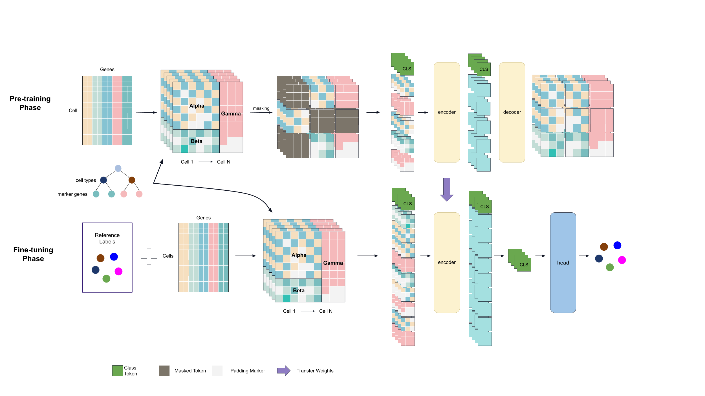

## scMapNet: marker-based cell type annotation of single-cell RNA-seq data using vision transfer learning with Tabular-to-Image transformations

<div align="center">  

</div>

Official repo for [scMapNet: marker-based cell type annotation of single-cell RNA-seq data using vision transfer learning with Tabular-to-Image ], which is based on [Treemap](https://cran.r-project.org/web/packages/treemap/treemap.pdf) and [MAE](https://github.com/facebookresearch/mae)

# 🔧Install environment

1. Create environment with conda:

```

conda create -n scmapnet python=3.11.9
conda activate scmapnet

```

2. Install dependencies

```

git clone https://github.com/Yuz7/scMapNet.git
cd scMapNet
pip install -r requirements.txt

```

# 🌱scMapNet pipeline

To fine tune scMapNet on your own data, follow these steps:

1. Download the scMapNet pre-trained weights:[here](https://drive.google.com/file/d/1ZlguObYTDVE-H9AqX48lfMSnvP0iTUg5/view?usp=drive_link)


2. Generate treemap images with single-cell data (download baron dataset [here](https://drive.google.com/file/d/1YrG3xP_NeAlKKM7RzC38m2x9gtlffh6Y/view?usp=drive_link))

```

# -e expression file
# -m prior marker information
# -o output directory
# -f transfer file(symbol to id)
# -t expression file type: seurat(rds) df(csv)
# -s strategies: train test(only test) all(for assess)
# -n thread number

# an example of baron dataset

cd scMapNet
nohup ./generate_image_script.sh -e ../scdataset/sce_baron.rds -m treemap/marker_location.csv -o ../data/ -f treemap/ensemble_ID_transfer_new.csv -d 0 -t seurat -s all -n 48 > log/generate_image.log 2>&1 &

``` 

3. Start fine-tuning (use pancreas as example). A fine-tuned checkpoint will be saved during training. Evaluation will be run after training.

```

torchrun \
--standalone --nnodes 1 --nproc_per_node 2 main_finetune.py \
--output_dir ../finetune_pancreas \
--batch_size 16 \
--epochs 25 \
--nb_classes 11 \
--finetune ../pretrain_weights/checkpoint.pth \
--blr 1e-3 --layer_decay 0.75 \
--eval \
--weight_decay 0.05 --drop_path 0.2 --reprob 0.25 --smoothing 0.0 \
--dist_eval --data_path ../data/ > log/fintune_pancreas.log

```

4. Evaluation/prediction

```

torchrun \
--standalone --nnodes 1 --nproc_per_node 2 main_finetune.py \
--test \
--resume ../finetune_pancreas/checkpoint-22.pth \
--model vit_large_patch16 \
--batch_size 64 --nb_classes 15 \
--data_path ../data/ > log/mae_test.log 2>&1 &

```

5. novel cell type detection

```

torchrun \
--standalone --nnodes 1 --nproc_per_node 2 main_finetune.py \
--test \
--detect_novel_value 0.95 \
--resume ../finetune_pancreas/checkpoint-22.pth \
--model vit_large_patch16 \
--batch_size 64 --nb_classes 15 \
--data_path ../data/ > log/mae_test.log 2>&1 &

```
